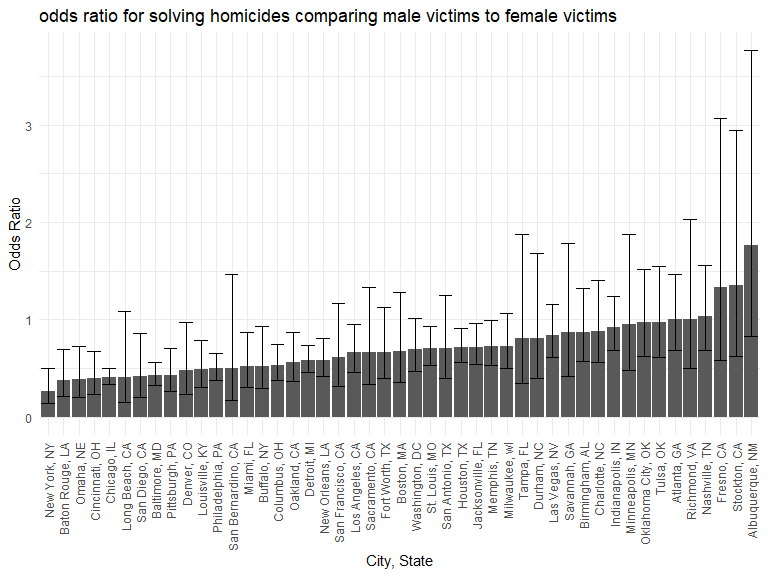

p8105_hw6_fz2352
================
2022-12-03

## Problem 2

``` r
homicides_df = read.csv("data/homicide-data.csv")
```

``` r
homicides_df = 
  homicides_df %>%
  mutate(city_state = str_c(city, state, sep = ", "),
         solved = case_when(
           disposition == "Closed without arrest" ~0,
           disposition == "Open/No arrest" ~ 0,
           disposition == "Closed by arrest" ~ 1
           ),
         victim_age = as.numeric(victim_age)) %>%
  filter(
    !(city_state %in% c("Dallas, TX", "Phoenix, AZ", " Kansas City, MO", "Tulsa, AL")),
    victim_race %in% c("White", "Black")
  )
```

``` r
fit = 
  homicides_df %>%
  filter(city == "Baltimore") %>%
  glm(solved ~ victim_age + victim_sex + victim_race, data = ., family = 'binomial')
```

``` r
fit %>% broom::tidy()
```

    ## # A tibble: 4 × 5
    ##   term             estimate std.error statistic  p.value
    ##   <chr>               <dbl>     <dbl>     <dbl>    <dbl>
    ## 1 (Intercept)       0.310     0.171        1.81 7.04e- 2
    ## 2 victim_age       -0.00673   0.00332     -2.02 4.30e- 2
    ## 3 victim_sexMale   -0.854     0.138       -6.18 6.26e-10
    ## 4 victim_raceWhite  0.842     0.175        4.82 1.45e- 6

``` r
coef_sex = fit %>% broom::tidy() %>% filter(term == "victim_sexMale") %>% pull(estimate)
se_sex = coef_sex = fit %>% broom::tidy() %>% filter(term == "victim_sexMale") %>% pull(std.error)
```

The odds ratio for solving homicides comparing male to female victims
keeping all other variables fixed is 1.1481778

``` r
lower_ci = exp(coef_sex - se_sex)
higher_ci = exp(coef_sex + se_sex)
```

The confidence interval is 1, 1.3183123

``` r
get_coef_sex = function(results) {
  results %>% filter(term == "victim_sexMale") %>% pull(estimate)
}

get_se_sex = function(results) {
  results %>% filter(term == "victim_sexMale") %>% pull(std.error)
}

get_CI = function(lower, higher) {
  c(lower, higher)
}
```

``` r
fit_df = 
  homicides_df %>%
  select(city_state, solved, victim_age, victim_sex, victim_race) %>%
  group_by(city_state) %>%
  nest() %>%
  mutate(
    models = map(data, ~glm(solved ~ victim_age + victim_sex + victim_race, data = ., family = 'binomial')),
    results = map(models, broom::tidy)) %>%
  select(-data, -models) %>%
  mutate(
    coef_sex = as.numeric(map(results, get_coef_sex)),
    se_sex = as.numeric(map(results, get_se_sex)),
    OR = exp(coef_sex),
    lower_ci = exp(coef_sex - 1.96 * se_sex),
    higher_ci = exp(coef_sex + 1.96 * se_sex),
    ) %>%
  select(city_state, OR, lower_ci, higher_ci)
```

``` r
fit_df %>%
  ungroup() %>%
  mutate(city_state = fct_reorder(city_state, OR)) %>%
  ggplot(aes(x = city_state, y = OR)) +
  geom_bar(position = position_dodge(), stat = "identity") + 
  geom_errorbar(aes(ymin = lower_ci, ymax = higher_ci)) +
  theme(axis.text.x = element_text(angle = 90, vjust = 0.5, hjust = 1)) +
  labs(
    title = "odds ratio for solving homicides comparing male victims to female victims",
    x = "City, State",
    y = "Odds Ratio"
  )
```



In Cities from New York, NY to Tulsa, OK, homicides in which the victim
is male are less likely to be resolved than those in which the victim is
female. New York has the lowest OR = 0.2623978, which means homicides in
which the victim is male is significantly less likely to be resolved.

In cities from Atlanta, GA to Albuquerque, NM, homicides in which the
victim is male are more likely to be resolved than those in which the
victim is female. Albuquerque, NM has the highest OR = 1.7674995. which
means homicides in which the victim is male is significantly more likely
to be resolved.

## Problem 3

``` r
birthweight_df = read.csv("data/birthweight.csv")
```

``` r
birthweight_df =
  birthweight_df %>%
  mutate(
    babysex = as.factor(babysex),
    frace = as.factor(frace),
    malform = as.factor(malform),
    mrace = as.factor(mrace)
  )
```

``` r
sum(is.na(birthweight_df))
```

    ## [1] 0

``` r
fit1 = lm(bwt ~ blength + babysex + malform, data = birthweight_df)
```

I chose `blength`, `fincomt`, and `malform` to include in my model
because the longer the baby’s length at birth, the more likely the baby
has higher birth weight. The baby’s sex can also affect birth weight
because male baby often has higher birth weight. The presence of
malformation can also significantly decrease or increase birth weight.

``` r
birthweight_df %>%
  modelr::add_predictions(fit1) %>%
  modelr::add_residuals(fit1) %>%
  ggplot(aes(x = pred, y = resid)) + 
  geom_point()
```


``` r
fit2 = lm(bwt ~ blength + gaweeks, data = birthweight_df)
fit3 = lm(bwt ~ bhead + blength + babysex + bhead * blength + bhead * babysex + blength * babysex + bhead * blength * babysex, data = birthweight_df)
```

``` r
cv_df = 
  crossv_mc(birthweight_df, 100) %>%
  mutate(
    train = map(train, as_tibble),
    test = map(test, as_tibble),
    mod1 = map(train, ~lm(bwt ~ blength + babysex + malform, data = .x)),
    mod2 = map(train, ~lm(bwt ~ blength + gaweeks, data = .x)),
    mod3 = map(train, ~lm(bwt ~ bhead + blength + babysex + bhead * blength + bhead * babysex + blength * babysex + bhead * blength * babysex, data = .x))
    ) %>%
  mutate(
    rmse1 = map2_dbl(mod1, test, ~rmse(model = .x, data = .y)),
    rmse2 = map2_dbl(mod2, test, ~rmse(model = .x, data = .y)),
    rmse3 = map2_dbl(mod3, test, ~rmse(model = .x, data = .y))
  )
```

``` r
cv_df %>% 
  select(starts_with("rmse")) %>% 
  pivot_longer(
    everything(),
    names_to = "model", 
    values_to = "rmse",
    names_prefix = "rmse_") %>% 
  mutate(model = fct_inorder(model)) %>% 
  ggplot(aes(x = model, y = rmse)) + geom_violin()
```


Model 3(i.e. One using head circumference, length, sex, and all
interactions between these) is the best model because it has the lowest
rmse.
